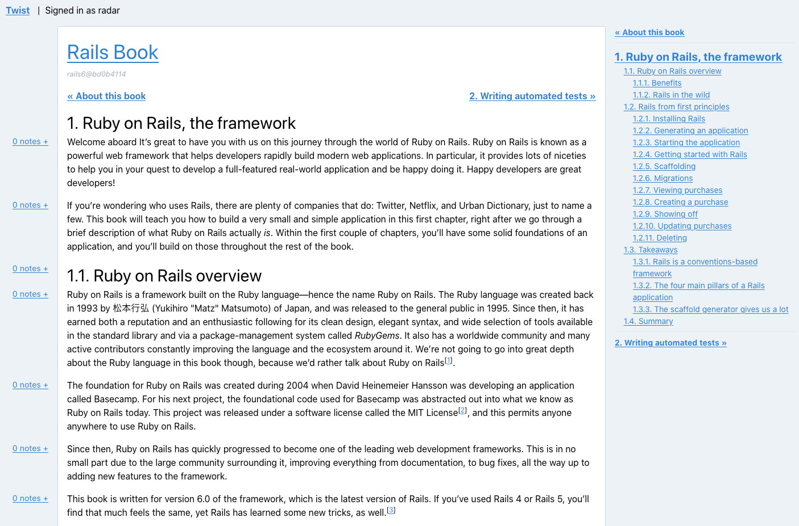

# Twist (v2)

This is a rewrite of my [Rails-based book review app](http://github.com/radar/twist) in [rom-rb](https://rom-rb.org/), [dry-rb](https://dry-rb.org/), (some parts of) [Hanami](https://hanamirb.org/), [Sidekiq](https://sidekiq.org/), [GraphQL](https://graphql.org/), [React](https://reactjs.org/), [Reach Router](https://reach.tech/router/), [Apollo](https://www.apollographql.com/), [TypeScript](https://www.typescriptlang.org/), [GraphQL Code Generator](https://graphql-code-generator.com/), [Tailwind](https://tailwindcss.com/), and whatever other Cool Hipster Tech™ I can get my grubby hands on.

I am currently using this application to let early reviewers read my books and to leave comments on them.



# Structure / Philosophy

My philosophy for developing this app revolves around separating two main parts of the codebase:

1. The backend: retrieves data from data sources (GitHub / the database), and presents it for frontend consumption
2. The frontend: retrieves data from the Backend, has no idea where it came from, and presents it to the user

I'm hoping with this app to demonstrate that it _is_ possible to separate these two layers into two separate applications. My mental map of data flow within the application goes something like this:

```
DB <-> Backend Repositories <-> Backend GraphQL endpoint <-> Frontend <-> Browser
```

I want to demonstrate with this app that it's possible to build a frontend that only has knowledge of how to find data, not how it is constructed. In this app, the `frontend` component knows only that it can find data at `/graphql`. It has no knowledge at all about how the backend collects that data for presentation.

I want to also demonstrate that it's possible to build a backend app that is data-store agnostic. With the use of the [Repository Pattern](https://msdn.microsoft.com/en-us/library/ff649690.aspx), the backend application knows only that it can talk to the repositories to collect the data. The backend application knows _nothing_ about how that data is collected. Today, the repositories talk to a PostgreSQL database, but tomorrow it could just as easily be a Redis store and (assuming the data returned is the same), the backend app wouldn't know the difference.

## READMEs

The READMEs for the [backend](http://github.com/radar/twist-v2/tree/master/backend/README.md) and the [frontend](http://github.com/radar/twist-v2/tree/master/frontend/README.md) can be found in their respective apps.
